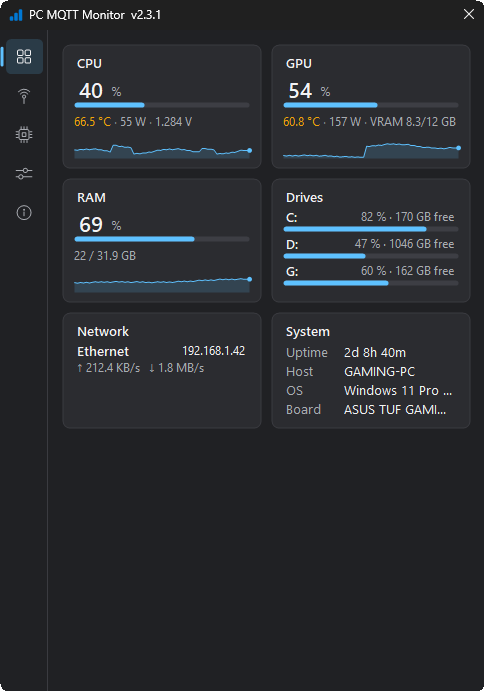
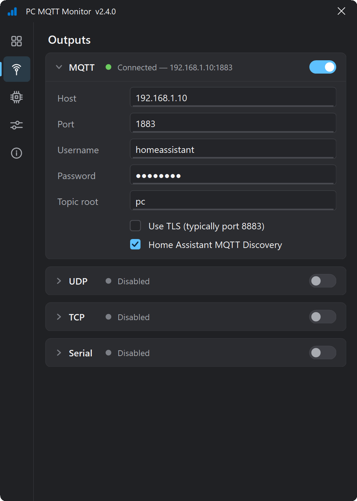
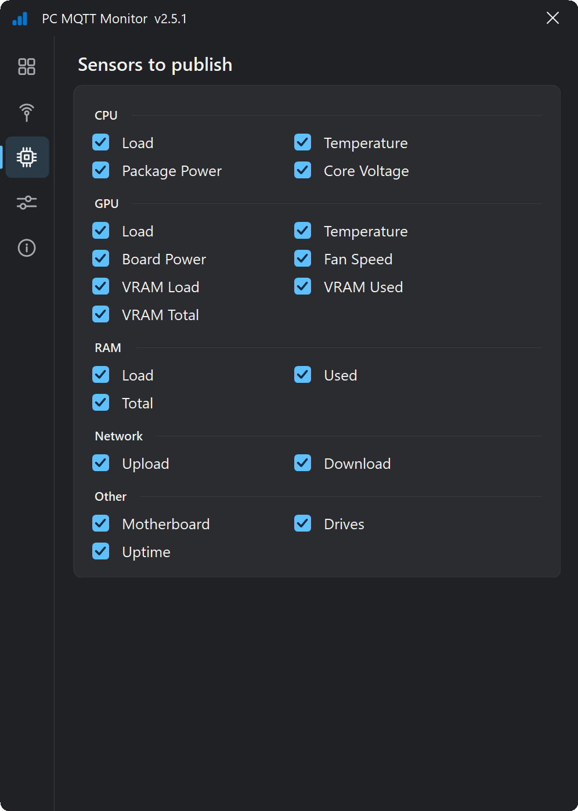
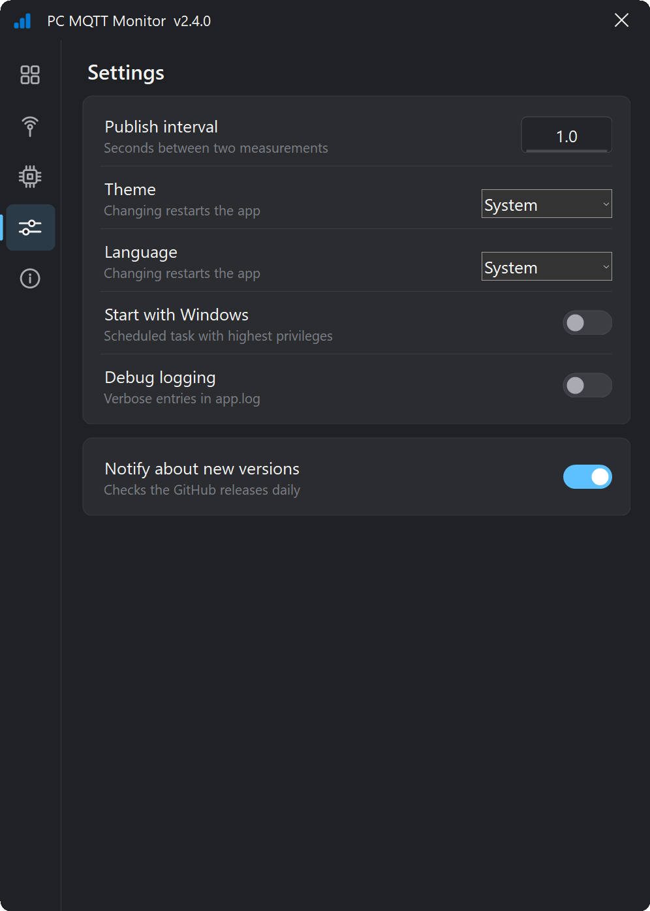
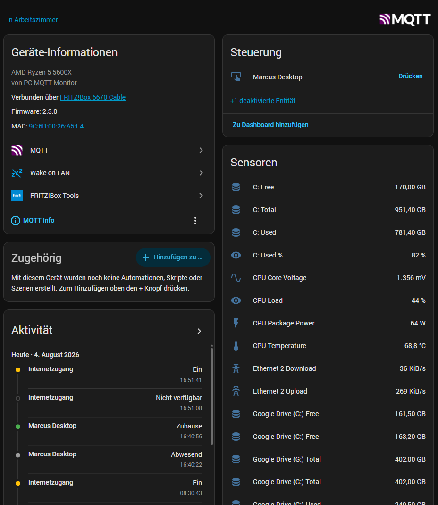

<h1 align="center">PC MQTT Monitor</h1>

<p align="center">
  A lightweight Windows tray app that streams your PC's hardware sensors —<br>
  CPU, GPU, RAM, drives, network — wherever you need them:<br>
  <b>MQTT</b> (native Home Assistant discovery) · <b>UDP</b> · <b>TCP</b> · <b>Serial</b>
</p>

<p align="center">
  <a href="https://github.com/mvoss96/PcMqttMonitor/releases/latest"></a>
  
  
  
</p>

<p align="center">
  
</p>

<details>
  <summary><b>More screenshots</b> — Outputs · Sensors · Settings</summary>
  <p align="center">
    
    
    
  </p>
</details>

Sensors are read via [LibreHardwareMonitor](https://github.com/LibreHardwareMonitor/LibreHardwareMonitor). All four outputs can run at the same time and are toggled independently in the app.

## Features

- **Hardware metrics**: CPU load/temperature/package power/core voltage, GPU load/temperature/power/fan/VRAM, RAM usage, drive usage, network up/download, uptime
- **Multiple outputs** ("sinks"), each independently switchable:
  - **MQTT** with availability topic + Last Will, retained values, optional TLS and auth
  - **Home Assistant MQTT Discovery** (opt-in): all sensors appear automatically as one HA device
  - **UDP**: one compact JSON datagram per snapshot to a fixed host:port
  - **TCP**: the app listens on a port and streams line-delimited JSON to every connected client
  - **Serial**: line-delimited JSON to a COM port (e.g. an ESP32 status display)
- **Modern tray UI**: icon sidebar with dashboard (cards, live bars, 60-second sparklines), outputs, sensor toggles, settings and about pages; light/dark/system theme
- **Two languages**: English and German — follows Windows by default, switchable in Settings (MQTT topics, payloads and HA entity names always stay English)
- **Live apply**: changed settings take effect immediately — outputs are rebuilt on the fly, no app restart
- **Update notification**: checks GitHub releases daily (opt-out) and notifies via tray balloon and an in-app pill — never downloads or installs anything by itself
- **Robust**: auto-reconnect, crash logging, automatic restart on hardware-driver crashes, autostart via Task Scheduler

## Installation

Download the latest `PcMqttMonitorSetup-x.y.z.exe` from the [releases page](https://github.com/mvoss96/PcMqttMonitor/releases/latest) and run it. The installer:

- installs to `C:\Program Files\PcMqttMonitor`
- optionally registers autostart at logon (via Task Scheduler, elevated)
- preserves your `config.json` across upgrades

> **Upgrading from 1.x**: the 2.0 config schema is sectioned and not backwards compatible. The app starts with defaults; re-enter your broker settings once in the Outputs page (or port your old `config.json` by hand, see below).

### Why does it require administrator rights?

LibreHardwareMonitor needs its kernel driver to read CPU temperature, package power, and voltages — without elevation those values silently read zero. The app therefore runs elevated (`requireAdministrator`), and autostart uses a scheduled task with highest privileges (the registry `Run` key silently skips elevated apps).

## Configuration

Everything is configured in the app (tray icon → window):

- **Outputs**: MQTT (host, port, TLS, credentials, topic root, HA discovery), UDP target, TCP listen port — each with its own enable toggle and live status
- **Sensors**: per-metric checkboxes
- **Settings**: publish interval, autostart, theme (system/light/dark), language (system/en/de), debug logging, update notifications

Changes are saved via the floating save panel and apply immediately. Settings are stored in `config.json` next to the exe:

```json
{
  "General": { "PublishIntervalSeconds": 1, "DebugEnabled": false, "Theme": "system", "UpdateCheckEnabled": true },
  "Mqtt":    { "Enabled": true, "Host": "192.168.1.10", "Port": 1883, "UseTls": false,
               "Username": "", "Password": "", "TopicRoot": "pc", "HaDiscoveryEnabled": true },
  "Udp":     { "Enabled": false, "Host": "", "Port": 5555 },
  "Tcp":     { "Enabled": false, "ListenPort": 5556 },
  "Serial":  { "Enabled": false, "Port": "COM3", "Baud": 115200 },
  "Sensors": { "CpuLoad": true, "CpuTemp": true, "...": true }
}
```

Note: the MQTT password is stored in plain text. The file lives in Program Files (writable only with admin rights, readable by local users) — fine for a trusted LAN setup, but keep it in mind.

## MQTT topics

With topic root `pc` and hostname `myhost`:

```
pc/myhost/availability        online | offline   (retained, set via Last Will on unclean disconnect)
pc/myhost/status              full JSON snapshot of all metrics
pc/myhost/cpu/load            12.3               (plain scalar subtopics, retained)
pc/myhost/cpu/temp            45
pc/myhost/cpu/power           28.5
pc/myhost/cpu/voltage         1.225
pc/myhost/gpu/load            5
pc/myhost/gpu/temp            38
pc/myhost/gpu/vram_used       1234
pc/myhost/ram/load            42.1
pc/myhost/drives/c/name       System (C:)        (one subtree per drive, keyed by letter)
pc/myhost/drives/c/type       SSD                (SSD / HDD / USB, omitted if unknown)
pc/myhost/drives/c/percent    61.2
pc/myhost/fans/fan_2/rpm      861                (one subtree per enabled fan channel)
pc/myhost/fans/fan_2/pwm      46.3
pc/myhost/net/0/name          Ethernet           (one subtree per active physical adapter)
pc/myhost/net/0/up            12.3               (KiB/s)
pc/myhost/net/0/down          345.6
pc/myhost/net/0/ip            192.168.1.23
pc/myhost/net/0/mac           a4:bb:6d:3f:12:9c
pc/myhost/system/uptime       86400              (seconds)
...
```

When Home Assistant discovery is enabled, a retained device-discovery config is published under `homeassistant/device/...` and HA picks up all sensors automatically — the PC appears as one device with all its entities:

<p align="center">
  
</p>

## UDP / TCP / Serial streams

All stream sinks send the same compact JSON object as the MQTT `status` topic — one object per datagram (UDP) or per line (TCP and serial):

```json
{"TimestampUtc":"2026-08-04T10:56:03Z","Host":"MYHOST","Cpu":{"Name":"AMD Ryzen 5 5600X","Load":8,"TempC":45.5,...},...}
```

Quick ways to consume the TCP stream:

```bash
# shell
nc myhost 5556 | jq .Cpu.Load
```

```python
# python
import socket, json
s = socket.create_connection(("myhost", 5556))
for line in s.makefile():
    print(json.loads(line)["Cpu"]["TempC"])
```

UDP is fire-and-forget; TCP clients that stop reading are dropped after a short write timeout so they can never stall publishing. The serial sink reopens the port automatically when the device is re-plugged — on a microcontroller, just read lines and `deserializeJson` each one (at 115200 baud a ~800-byte snapshot takes ~70 ms, fine for 1-second intervals).

## Building from source

Requires the .NET 10 SDK and (for the installer) [Inno Setup 6](https://jrsoftware.org/isinfo.php).

```powershell
# Self-contained single-file exe
dotnet publish PcMqttMonitor.csproj -c Release -r win-x64 --self-contained true -p:PublishSingleFile=true -o publish

# Installer (optional)
& "$env:LOCALAPPDATA\Programs\Inno Setup 6\ISCC.exe" installer.iss
```

Run with `--console` to see log output in the launching terminal.

## License

[MIT](LICENSE). Uses [LibreHardwareMonitorLib](https://github.com/LibreHardwareMonitor/LibreHardwareMonitor) (MPL-2.0) and [MQTTnet](https://github.com/dotnet/MQTTnet) (MIT).
